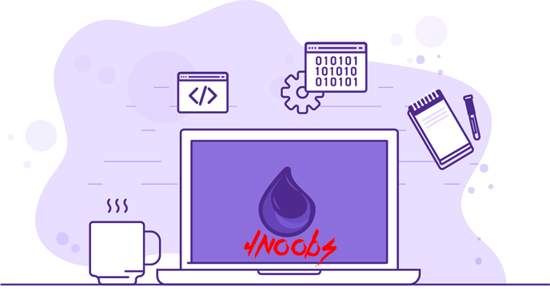

  

<h3 align="center">
  Elixir4Noobs desenvolvido por <strong>aleDsz</strong>
   
  
</h3>

  <strong>O curso básico/iniciante está finalizado :)</strong>
   
  <a href="#conteúdos"><strong>Explore a documentação »</strong></a>
   
   
  <a href="https://github.com/aleDsz/elixir4noobs">Report Bug</a>
   
  <a href="https://github.com/aleDsz/elixir4noobs">Request Feature</a>

## Conteúdos

1. Introdução
    - [Sobre o Projeto](./4noobsDocs/1-Introducao_1-Sobre-o-projeto.md)
    - [Pré-requisitos](./4noobsDocs/1-Introducao_2-Pre-requisitos.md)
      * [Conhecimentos Necessários](./4noobsDocs/1-Introducao_2-Pre-requisitos.md#conhecimentos-necessários)
      * [Instalação](./4noobsDocs/1-Introducao_2-Pre-requisitos.md#instalação)
2. Ambiente
    - [Como começar?](./4noobsDocs/2-Ambiente_1-Como-comecar.md)
3. Linguagem
    - [Sobre a linguagem](./4noobsDocs/3-Linguagem_1-Sobre-a-linguagem.md)
      * [Extensão](./4noobsDocs/3-Linguagem_1-Sobre-a-linguagem.md#extensão)
    - [Paradigma](./4noobsDocs/3-Linguagem_2-Paradigma.md)
    - [Expressões](./4noobsDocs/3-Linguagem_3-Expressoes.md)
    - [Sintaxe](./4noobsDocs/3-Linguagem_4-Sintaxe.md)
    - [Módulos](./4noobsDocs/3-Linguagem_5-Modulos.md)
      * [Funções](./4noobsDocs/3-Linguagem_5-Modulos.md#funções)
    - [Estruturas de Repetição](./4noobsDocs/3-Linguagem_6-Estruturas-de-Repeticao.md)
    - [Estruturas de Decisão](./4noobsDocs/3-Linguagem_7-Estruturas-de-Decisao.md)
    - [Variáveis](./4noobsDocs/3-Linguagem_8-Variaveis.md)
      * [Tipos](./4noobsDocs/3-Linguagem_8-Variaveis.md#tipos)
4. Recursos extras
    - [Gerenciador de Pacotes](./4noobsDocs/4-Recursos-Extras_1-Gerenciador-de-Pacotes.md)
      * [Terminal Interativo](./4noobsDocs/4-Recursos-Extras_1-Gerenciador-de-Pacotes.md#terminal-interativo)
    - [Testes](./4noobsDocs/4-Recursos-Extras_2-Testes.md)
    - [Pattern Matching](./4noobsDocs/4-Recursos-Extras_3-Pattern-Matching.md)
    - [Bibliotecas](./4noobsDocs/4-Recursos-Extras_4-Bibliotecas.md)

## Quero contribuir

Para contribuir com esse projeto maravilhoso, você:

1. Precisará criar um fork deste repositório
2. Criar um branch com o padrão: `feature/awesome-commit`
3. Criar seu conteúdo maravilhoso nesta branch
4. Criar um pull-request neste repositório lindo
5. Esperar a avaliação do mesmo

E tchadam! Tá pronto o sorvetinho ✨

## Autores

- **Alexandre de Souza (aleDsz)** - _Alchemist & Developer_ [Twitter](https://twitter.com/aleDsz)

  Made with 💜

